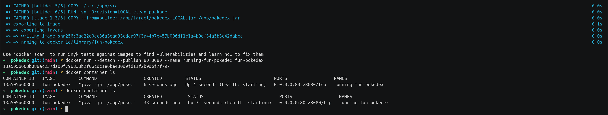

# Pokedex API

An API returning Pokemon information by name.  
Featuring an endpoint which returns a funny version of the Pokemon description.

## Want to try it out before installing anything?
Check the online OpenApi documentation [https://fun-pokedex.herokuapp.com/swagger-ui.html](https://fun-pokedex.herokuapp.com/swagger-ui.html).

You can use it to make API calls directly form the browser.

## Getting started running the app locally
The easiest way to get started is to use Docker, as you won't have to configure your
local Java environment. Download and install Docker here [https://docs.docker.com/desktop/](https://docs.docker.com/desktop/)
if you do not have it already.

Also make sure you have git installed. If you don't, follow the instructions for your platform
at [https://git-scm.com/download](https://git-scm.com/download).

Click the image below to watch the screen recoding:
[](https://asciinema.org/a/GGy0xfnDb925mcYqpbqBPxQt8)

### Check out the codebase
- From the terminal, cd to your favorite project directory, and run the following
```bash
git clone git@github.com:nico-incubiq/pokedex.git
```

### Building the app image
- From the directory where you checked-out the codebase, run the following command in the terminal
```bash
docker build --tag fun-pokedex .
```

### Starting the app
- Run the following command in the terminal to run the app locally on **port 80**
```bash
docker run --detach --publish 80:8080 --name running-fun-pokedex fun-pokedex
```
- You can check the application is running and healthy using the below command.
As soon as it displays `(healthy)`, you know the app is running.
```bash
docker container ls
```
- You can also check the logs of the application with this command
```bash
docker logs -f running-fun-pokedex
```
- Open your favorite browser at [http://localhost/swagger-ui.html](http://localhost/swagger-ui.html) to start using the app
- Or test from the terminal with `curl` and `jq` (if you have them)
```bash
curl -s http://localhost/pokemon/mewtwo | jq
```

### Winding down
- Stop and remove the container
```bash
docker container rm --force running-fun-pokedex
```

## To change for production
### Caching
- There is realistically not that many Pokemons out there, it would be more
efficient to just download the full list and store it locally in a file in
the project. Gotta Cach'Em All!
- Same thing for the description transformations, this is a static operation
that will never change at runtime either, so it could be computed in advance
and stored in a file.
- If storage in a static file is not acceptable, we could implement a simple cache, either
by deploying an additional Redis / Memcached server, or by using a `WeakHashMap`.

### Security
- Add rate limiting; even more considering we are hitting external downstream
services; it would be considerate.

### Subscriptions
- FunTranslations has a paid plan which lifts the rate limiting, this would be to
consider for production.

### Circuit breaker
- Implement the circuit breaker pattern to alleviate the negative impact of
downstream APIs being down.
